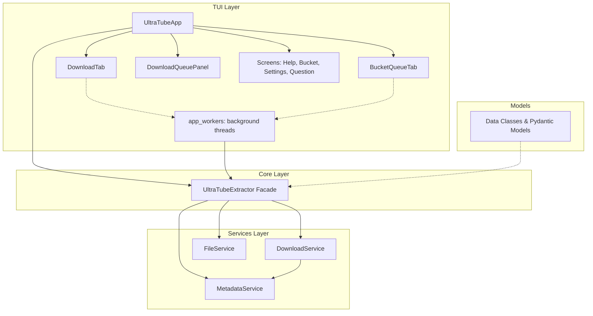

# UltraTube v2 — Architecture & Design Specifications

This document provides a comprehensive technical overview of the UltraTube codebase, detailing the architecture, files, and classes.

---

## 1. Architectural Overview

UltraTube is a terminal-based (TUI) YouTube downloader written in Python. It uses the **Textual** framework for its user interface and **yt-dlp** (via **static-ffmpeg**) for extracting metadata and downloading media.

The application follows a **Modular Facade & Service-Oriented Architecture**:



- **TUI Layer (View/Controller)**: Manages widgets, user inputs, tabs, and modals. Runs blocking tasks (like downloads and metadata validation) in background worker threads to keep the UI responsive.
- **Core Facade**: `UltraTubeExtractor` serves as a unified entry point that orchestrates metadata extraction, downloading, and media/subtitle processing.
- **Services**: Specialized services manage specific tasks: `MetadataService` (caching and parsing metadata), `DownloadService` (handling download operations), and `FileService` (running FFmpeg commands, processing outputs, and cleaning up temp files).
- **Models**: Simple dataclasses and Pydantic models represent entities (e.g., `VideoInfo`, `AudioTrack`, `DownloadOptions`, `AppSettings`).

---

## 2. File Directory

The codebase consists of the following primary files:

| File Name | Layer | Primary Responsibility |
| :--- | :--- | :--- |
| [ultratube_main.py](file:///c:/programming/projectes/ultratube%20v2/ultratube_main.py) | Entry Point | Starts the application by calling `main()` in `ultratube_app.py`. |
| [ultratube_app.py](file:///c:/programming/projectes/ultratube%20v2/ultratube_app.py) | TUI App Coordinator | Main Textual application class (`UltraTubeApp`). Coordinates routing, global shortcuts, thread safety, and global layout. |
| [download_tab.py](file:///c:/programming/projectes/ultratube%20v2/download_tab.py) | TUI View (Single Download) | `DownloadTab` widget. Represents a single video/playlist download panel with options, progress details, and logs. |
| [bucket_tab.py](file:///c:/programming/projectes/ultratube%20v2/bucket_tab.py) | TUI View (Bulk Download) | `BucketQueueTab` widget. Displays a unified batch progress panel for multiple concurrent downloads. |
| [queue_panel.py](file:///c:/programming/projectes/ultratube%20v2/queue_panel.py) | TUI View (Sidebar Queue) | `DownloadQueuePanel` widget. Sidebar list showing the active/completed downloads. |
| [app_screens.py](file:///c:/programming/projectes/ultratube%20v2/app_screens.py) | TUI Views (Modals) | Modal overlays: `HelpScreen` (shortcuts table), `QuestionModal` (dialog confirmations), and `BucketScreen` (bulk config dashboard). |
| [settings_screen.py](file:///c:/programming/projectes/ultratube%20v2/settings_screen.py) | TUI View (Settings Screen) | `SettingsScreen` dashboard. Modifies and saves application preferences. |
| [app_workers.py](file:///c:/programming/projectes/ultratube%20v2/app_workers.py) | TUI Concurrency | Background thread worker functions (`run_download_thread` and `run_playlist_download_thread`). |
| [app_messages.py](file:///c:/programming/projectes/ultratube%20v2/app_messages.py) | TUI Messaging | Custom Textual `Message` classes for thread-safe UI communication. |
| [ultratube_extractor.py](file:///c:/programming/projectes/ultratube%20v2/ultratube_extractor.py) | Core Facade | `UltraTubeExtractor`. Orchestrates calls across services and validates URL inputs. |
| [download_service.py](file:///c:/programming/projectes/ultratube%20v2/download_service.py) | Service | `DownloadService` (invokes `yt-dlp` download processes) and `YtDlpLogger` (captures yt-dlp logging). |
| [metadata_service.py](file:///c:/programming/projectes/ultratube%20v2/metadata_service.py) | Service | `MetadataService`. Fetches and caches video/playlist details to avoid repeated network hits. |
| [file_service.py](file:///c:/programming/projectes/ultratube%20v2/file_service.py) | Service | `FileService`. Resolves FFmpeg path, merges subtitles, and processes media output files. |
| [settings_service.py](file:///c:/programming/projectes/ultratube%20v2/settings_service.py) | Service / Configuration | Handles loading, saving, and validation of global `AppSettings`. |
| [models.py](file:///c:/programming/projectes/ultratube%20v2/models.py) | Models | Core data structures used to pass information between TUI and services. |
| [messages.py](file:///c:/programming/projectes/ultratube%20v2/messages.py) | Constants | String constants and error messages used throughout the user interface. |
| [app_utils.py](file:///c:/programming/projectes/ultratube%20v2/app_utils.py) | Utilities | Helper functions for formatting bytes, speeds, time strings, and clipboard copying. |

---

## 3. Layered Components Detail

### 3.1 TUI Layer (View / Controller)

#### `UltraTubeApp` (in `ultratube_app.py`)
- **Base Class**: `textual.app.App`
- **Responsibility**: App coordinator. Boots the TUI, manages active tabs, handles keystrokes (e.g. `ctrl+t` to open a tab, `ctrl+s` for settings), listens to messages posted by background threads, and initiates thread-safe GUI updates.
- **Key Attributes**:
  - `extractor: UltraTubeExtractor` — The core facade instance.
  - `tab_counter: int` — Counter to assign unique IDs to tabs.
  - `download_records: Dict[str, DownloadRecord]` — Tracked downloads displayed in the sidebar.
  - `cancelled_tabs: set` — Set of tab IDs marked for cancellation.
  - `settings: AppSettings` — Currently loaded global settings.
  - `pending_merges: Dict[str, Tuple[str, List[str]]]` — Path details of completed downloads waiting for subtitle integration.
- **Key Methods**:
  - `compose() -> ComposeResult`: Sets up the initial screen layout (`Header`, `TabbedContent`, `DownloadQueuePanel` sidebar, and `Footer`).
  - `action_new_tab()`: Creates a new `DownloadTab` pane and activates it.
  - `action_close_tab()`: Closes the current tab pane, triggering cancellation if active.
  - `action_bucket()`: Opens the `BucketScreen` overlay.
  - `add_bucket_batch_downloads(settings)`: Adds a unified `BucketQueueTab` containing multiple URL download targets.
  - `validate_url_action(tab_id)`: Extracts URL inputs and runs validation as a worker thread task (`do_validate_url`).
  - `handle_validation_result(...)`: Updates the corresponding tab when URL details are loaded (populates selectors).
  - `start_download_action(tab_id)`: Extracts configured parameters and spawns `run_download_thread` or `run_playlist_download_thread`.
  - `on_download_progress(...)`, `on_download_finished(...)`, `on_download_error_msg(...)`: Thread-safe Textual event handlers that process messages from workers.

#### `DownloadTab` (in `download_tab.py`)
- **Base Class**: `textual.containers.Vertical`
- **Responsibility**: Displays options and logs for a single URL download target. Holds states and updates options dynamically as URL validity changes.
- **Key Attributes**:
  - `tab_id: str` — Unique ID for reference.
  - `url: Optional[str]` — Initial pre-filled URL.
  - `status: TabStatus` — State machine status (`IDLE`, `FETCHING`, `DOWNLOADING`, etc.).
  - `video_info: Optional[VideoInfo]`, `playlist_info: Optional[Dict]` — Extracted metadata models.
- **Key Methods**:
  - `compose() -> ComposeResult`: Lays out URL input container, options controls (selects for audio/video format, quality, subtitles, metadata switches, output directory input), progress bar widget, and log terminal wrapper.
  - `update_status(text, status_class)`: Helper to update status messages below input.
  - `show_star_panel()`: Transitions tab into showing the GitHub Star request view.
  - `reset_to_idle()`: Clears the tab so users can enter another URL.

#### `BucketQueueTab` (in `bucket_tab.py`)
- **Base Class**: `textual.containers.Vertical`
- **Responsibility**: Unified tab layout displaying a batch download queue. Rather than configuring one video, it coordinates a table of multiple files downloading concurrently.
- **Key Attributes**:
  - `downloads: Dict[str, DownloadRecord]` — Maps sub-task IDs to download records.
  - `sub_id_to_url: Dict[str, str]` — Maps sub-task IDs to their original URLs.
- **Key Methods**:
  - `compose() -> ComposeResult`: Renders aggregated batch progress bar, `DataTable` of item states (columns: Title, Status, Size, Progress, Speed, ETA), and aggregated log list.
  - `update_download_progress(...)`, `update_download_finished(...)`, `update_download_error(...)`: Modifies the cells of specific table rows.
  - `update_overall_progress()`: Re-calculates and displays aggregated batch progress.

#### `HelpScreen` (in `app_screens.py`)
- **Base Class**: `textual.screen.ModalScreen`
- **Responsibility**: Keyboard shortcuts layout overlay. Dimmed background block showing keybindings.

#### `QuestionModal` (in `app_screens.py`)
- **Base Class**: `textual.screen.ModalScreen[bool]`
- **Responsibility**: General-purpose Yes/No dialog modal (e.g. asking to merge subtitles or delete original files).

#### `BucketScreen` (in `app_screens.py`)
- **Base Class**: `textual.screen.Screen[Optional[BucketDownloadSettings]]`
- **Responsibility**: Configuration dashboard for bulk downloads. Validates a list of input URLs in real-time, displays parsed counts, and provides options (Mode, Format, Quality, Folder) for the batch.

#### `SettingsScreen` (in `settings_screen.py`)
- **Base Class**: `textual.screen.Screen[None]`
- **Responsibility**: Global preferences panel. Allows modifying default directory, format, mode, and features toggles. Updates saved settings on save submission.

#### `DownloadQueuePanel` (in `queue_panel.py`)
- **Base Class**: `textual.containers.Vertical`
- **Responsibility**: Sidebar container that displays a `DataTable` of all active and past download records.

#### `app_messages.py` — Worker Messages
Inherit from `textual.message.Message`. Posted from threads back to the main app thread:
- `DownloadProgress`: Broadcasts downloading speeds, ETAs, percentages, and files details.
- `DownloadFinished`: Reports completion path and byte sizes.
- `DownloadErrorMsg`: Passes exception text when download fails.
- `LogMsg`: Redirects output messages to the tab terminal display.
- `PlaylistProgress`: Relays index counts and names of current playlist items.
- `PlaylistFinished`: Relays summary (skipped count, download count, size) of a completed playlist.

#### `app_workers.py` — Background Workers
Includes functions that execute inside threading instances:
- `run_download_thread(...)`: Triggers audio or video downloading on the extractor. Wraps callbacks to post `DownloadProgress` and `LogMsg` messages back to the TUI.
- `run_playlist_download_thread(...)`: Iterates through list entries in a playlist. Sequentially coordinates downloads of individual videos.

---

### 3.2 Core Layer (Facade)

#### `UltraTubeExtractor` (in `ultratube_extractor.py`)
- **Responsibility**: Facade pattern implementation. Provides a clean api for the TUI while delegating heavy operations to internal services.
- **Key Methods**:
  - `is_valid_url(url) -> Tuple[bool, Optional[str]]`: Evaluates URLs. Checks structure using regex, then queries metadata via `MetadataService` to check availability.
  - `get_available_formats(url, is_audio)`: Queries `MetadataService` for extensions.
  - `download_audio(url, options, ...)`: Directs target downloading to `DownloadService`.
  - `download_video(url, quality, options, ...)`: Directs target downloading to `DownloadService`.
  - `merge_subtitles(media_file, subtitle_files, ...)`: Directs post-processing to `FileService`.

---

### 3.3 Services Layer

#### `DownloadService` (in `download_service.py`)
- **Responsibility**: Interacts with `yt-dlp` to execute downloads. Builds custom options maps based on `DownloadOptions` parameters and quality parameters, then executes extraction.
- **Key Methods**:
  - `download_audio(...)` / `download_video(...)`: Prepares `ydl_opts` including postprocessors (metadata, thumbnail, chapters, formatting), sets progress hooks, and starts `yt_dlp.YoutubeDL`.
  - `download_subtitles(url, subtitle_ids, output_dir, log_callback)`: Downloads subtitle tracks separately as `.vtt` format.
- **Helper Function**: `make_progress_hook(progress_callback)` converts yt-dlp progress hooks into structured dictionary data.

#### `YtDlpLogger` (in `download_service.py`)
- **Responsibility**: Intercepts stdout/stderr streams from `yt-dlp` and forwards non-progress logs to the UI logs using the provided callback.

#### `MetadataService` (in `metadata_service.py`)
- **Responsibility**: Handles video and playlist details retrieval.
- **Key Attributes**:
  - `_video_info_cache: Dict[str, Dict]` — Cache map storing raw yt-dlp dictionaries.
  - `_cache_timestamps: Dict[str, float]` — Timestamp map for TTL validation.
- **Key Methods**:
  - `get_video_info(url) -> VideoInfo`: Retrieves video info. Checks cache first, otherwise executes `YoutubeDL.extract_info` without downloading.
  - `get_playlist_info(url)`: Extracts playlist information (flat list configuration).
  - `get_audio_tracks(url) -> List[AudioTrack]`: Inspects video formats, filtering for audio channels and grouping languages.

#### `FileService` (in `file_service.py`)
- **Responsibility**: Resolves environment dependencies and executes local file changes.
- **Key Methods**:
  - `get_ffmpeg_path() -> str`: Resolves the FFmpeg binary. Checks PyInstaller bundle structures (`sys._MEIPASS`), falls back to standard `static-ffmpeg` packages, and then system PATH.
  - `merge_subtitles(...)`: Invokes FFmpeg to mux `.vtt` subtitles into media containers (`mov_text` subtitles).
  - `process_download(file_path, options)`: Convers formats and adjusts bitrates if necessary.

#### `settings_service.py`
- **Responsibility**: Serializes and deserializes Pydantic preferences config to/from `~/.ultratube_settings.json`. Contains `load_settings()` and `save_settings(settings)`.

---

### 3.4 Models Layer

#### Data Structures (in `models.py`)
- `VideoInfo` (dataclass): Represents video details (id, title, duration, description, format maps, subtitle links).
- `AudioTrack` (dataclass): Describes audio formats (language, format ID, codec, bitrate).
- `Subtitle` (dataclass): Details subtitle properties (language, code, format ID, auto-generated flag).
- `DownloadOptions` (dataclass): Options for single download execution.
- `ProcessOptions` (dataclass): Muxing options passed to FFmpeg.
- `DownloadRecord` (dataclass): Row details stored in the sidebar table.
- `TabStatus` (Enum): Lifecycle states of a TUI tab.
- `BucketDownloadSettings` (BaseModel): Bulk configuration options container.
- `AppSettings` (BaseModel in `settings_service.py`): Application preferences container.

---

## 4. Concurrency & Thread-Safe UI Updates

Since downloading media is an I/O-bound process, running it in the main TUI thread would cause the interface to freeze. UltraTube handles this by using Python's `threading` library combined with Textual's message passing system.

### Thread Communication Flow

```
+-------------------------------------------------------------+
| TUI MAIN THREAD (Event Loop)                                |
|                                                             |
| 1. User clicks "Download" -> Spawns worker thread           |
| 2. Receives and processes custom Textual Messages           |
|    - on_download_progress() -> Updates Progress Bar & Stats  |
|    - on_log_msg()          -> Appends text to Log Console   |
|    - on_download_finished() -> Triggers modal / finishes     |
+-------------------------------------------------------------+
                            ^
                            | (Textual Message Posted via 
                            |  call_from_thread)
                            |
+-------------------------------------------------------------+
| BACKGROUND WORKER THREAD                                    |
|                                                             |
| - Calls UltraTubeExtractor.download_video()                 |
| - yt-dlp triggers progress hook callback                    |
| - Callback maps raw progress data to a Message object       |
| - Message is posted to the App using:                       |
|   app_instance.call_from_thread(app_instance.post_message,  |
|                                 DownloadProgress(...))      |
+-------------------------------------------------------------+
```

1. **Worker Creation**: When a download starts, the application calls `run_worker(..., thread=True)` to execute `run_download_thread` or `run_playlist_download_thread`.
2. **Callbacks**: The worker registers callback functions (`progress_callback` and `log_callback`) with the extractor.
3. **Thread Safety**: When a callback is invoked by `yt-dlp` in the background thread, it cannot directly modify UI widgets. Doing so would lead to race conditions.
4. **Message Posting**: Instead, it wraps the data in a Textual `Message` class (e.g. `DownloadProgress`) and posts it to the main application event loop using:
   ```python
   app_instance.call_from_thread(app_instance.post_message, message_object)
   ```
5. **UI Update**: The main thread receives this message and safely updates the widgets (such as the progress bar, speed labels, and data tables).

---

## 5. External Dependencies

The application relies on several key packages:

- **Textual**: Modern TUI framework providing reactive components, CSS layout styling (`ultratube.tcss`), event bindings, and modal screens.
- **yt-dlp**: Extractor backend. Communicates with YouTube APIs to load video streams and metadata.
- **static-ffmpeg**: Downloads and caches static, platform-appropriate FFmpeg binaries, ensuring subtitle muxing works without requiring manual FFmpeg installations.
- **Pydantic**: Data parsing and validation library used for managing configuration structures (`AppSettings` and `BucketDownloadSettings`).
