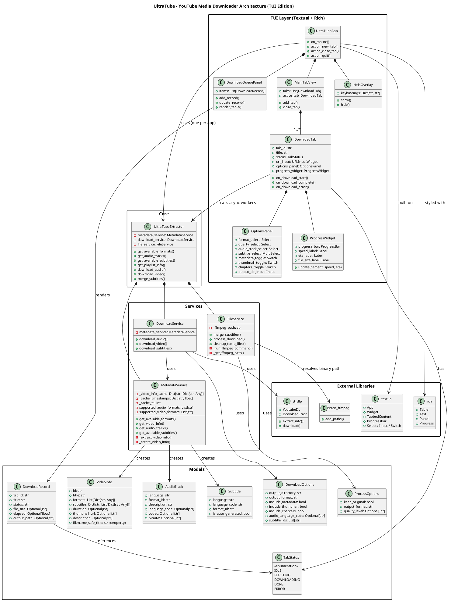

# UltraTube — User Stories & Feature Inventory

---

## 1. Existing Features (Current CLI)

### US-01 · Download Audio from a Single Video
**As a** user,  
**I want to** paste a YouTube URL and download its audio track,  
**so that** I can listen to it offline without video data.

**Acceptance criteria:**
- User provides a YouTube URL
- App fetches and displays available audio formats (mp3, m4a, wav, flac)
- User selects a format or accepts the default
- File is saved to the chosen output directory
- Filename is sanitized to be filesystem-safe

---

### US-02 · Download Video from a Single URL
**As a** user,  
**I want to** download a YouTube video at a chosen quality,  
**so that** I can watch it offline at the resolution I need.

**Acceptance criteria:**
- User selects from quality presets: highest, 1080p, 720p, 480p, 360p, 240p
- App maps quality to the best matching yt-dlp format selector
- Output is merged into the selected container (mp4, mkv, webm)
- File is saved to the chosen output directory

---

### US-03 · Select Output Format
**As a** user,  
**I want to** choose the output container/codec before downloading,  
**so that** the file is compatible with my player or workflow.

**Acceptance criteria:**
- For audio: choices are mp3, m4a, wav, flac (FFmpeg handles conversion)
- For video: only formats that the source actually has are shown
- A sensible default is pre-selected if the user skips

---

### US-04 · Select Audio Language Track
**As a** user,  
**I want to** pick a specific audio language track (e.g., dubbed version),  
**so that** I get the right language in the output file.

**Acceptance criteria:**
- App lists all available audio tracks with language name, codec, and bitrate
- User can pick one or accept the default track
- Selected language code is passed to the format selector in yt-dlp

---

### US-05 · Download Subtitles
**As a** user,  
**I want to** download subtitle tracks alongside the media,  
**so that** I can read along or share the file with captions.

**Acceptance criteria:**
- App lists all available subtitle tracks (manual and auto-generated, labelled)
- User can select one or more language codes (comma-separated in CLI)
- Subtitles are saved as `.vtt` files in the same output directory

---

### US-06 · Merge Subtitles into Media File
**As a** user,  
**I want to** embed downloaded subtitles directly into the media file,  
**so that** I have a single self-contained file with captions.

**Acceptance criteria:**
- After download, user is prompted whether to merge
- FFmpeg muxes the `.vtt` tracks into the container using `mov_text` codec
- Output is saved as `<title>_with_subs.<ext>`
- User is offered the option to delete the original un-merged file

---

### US-07 · Include Metadata
**As a** user,  
**I want to** embed video metadata (title, artist, description) into the file,  
**so that** my media library software picks it up automatically.

**Acceptance criteria:**
- Toggle on/off before downloading
- Uses yt-dlp's `FFmpegMetadata` post-processor

---

### US-08 · Include Thumbnail
**As a** user,  
**I want to** embed the video thumbnail into the file,  
**so that** the cover art appears in my media player.

**Acceptance criteria:**
- Toggle on/off before downloading
- Uses yt-dlp's `EmbedThumbnail` post-processor

---

### US-09 · Include Chapters
**As a** user,  
**I want to** embed chapter markers into downloaded videos,  
**so that** I can jump to sections in my media player.

**Acceptance criteria:**
- Toggle on/off before downloading (video only)
- Uses yt-dlp's `embedchapters` option

---

### US-10 · Download an Entire Playlist (Audio or Video)
**As a** user,  
**I want to** provide a playlist URL and download all its videos,  
**so that** I can archive or listen to a whole series offline.

**Acceptance criteria:**
- App fetches playlist metadata (title, video count, entries)
- Creates a subdirectory named after the playlist
- Applies the same format/quality/options to every video
- Reports per-video progress and handles individual failures gracefully without stopping the whole batch

---

### US-11 · Choose Output Directory
**As a** user,  
**I want to** specify where files are saved,  
**so that** downloads land in the right folder on my system.

**Acceptance criteria:**
- Default is `~/Downloads`
- User can override with any valid path
- Directory is created automatically if it does not exist

---

### US-12 · Metadata Caching
**As a** user,  
**I want** metadata for a URL to be fetched only once per session,  
**so that** repeated queries for the same video are fast.

**Acceptance criteria:**
- `MetadataService` caches raw info with a 1-hour TTL
- Second call for the same URL within TTL returns cached data immediately

---

## 2. New Features (Planned)

### US-13 · TUI Application Shell
**As a** user,  
**I want** a full-screen terminal user interface instead of a plain CLI prompt loop,  
**so that** the app is easier to navigate, visually clear, and feels modern.

**Acceptance criteria:**
- Built with **Textual** (layout, widgets, reactive state) and **Rich** (styled output, tables, progress bars)
- Has a persistent header with the app name and a footer with key bindings
- All interactions use keyboard navigation — no raw `input()` calls
- Responsive layout adapts to different terminal sizes

---

### US-14 · Multi-Tab Downloads (Concurrent Sessions)
**As a** user,  
**I want to** open multiple download tabs simultaneously,  
**so that** I can queue and run several downloads at the same time without waiting for each to finish.

**Acceptance criteria:**
- A "New Tab" action (e.g., `Ctrl+T`) opens a fresh download session tab
- Each tab is independent: its own URL, options, and progress state
- Tabs can be closed individually (`Ctrl+W`)
- Downloads in each tab run concurrently using `asyncio` workers
- A tab label shows the video title (or "New Tab") and a status indicator (idle / downloading / done / error)
- Maximum concurrent downloads is configurable (default: 4)

---

### US-15 · Real-Time Download Progress Bar
**As a** user,  
**I want to** see a live progress bar during a download,  
**so that** I know how far along it is and how fast it's going.

**Acceptance criteria:**
- Shows percentage complete, download speed (MB/s), and ETA
- Updates in real-time without blocking the UI (async download worker)
- Progress bar is rendered per-tab so multiple downloads are tracked separately
- On completion, shows final file size and elapsed time

---

### US-16 · Static FFmpeg (No System Dependency)
**As a** user,  
**I want** the app to use its own bundled FFmpeg binary,  
**so that** I don't have to install FFmpeg separately on my system.

**Acceptance criteria:**
- Replaces `subprocess` FFmpeg calls with **`static-ffmpeg`** (PyPI package)
- `static-ffmpeg` auto-downloads the correct platform binary on first run
- `FileService` and `DownloadService` use the binary path returned by `static_ffmpeg.add_paths()`
- Installation instructions do not mention FFmpeg as a prerequisite

---

### US-17 · Install via pip
**As a** developer or power user,  
**I want to** install UltraTube with a single `pip install` command,  
**so that** I can get it running immediately in any Python environment.

**Acceptance criteria:**
- Project has a `pyproject.toml` (or `setup.py`) with all dependencies declared
- Entry point registered so `ultratube` runs from the terminal after install
- All dependencies (yt-dlp, textual, rich, static-ffmpeg) are pinned in `requirements.txt`

---

### US-18 · Install via winget (Windows)
**As a** Windows user,  
**I want to** install UltraTube with `winget install UltraTube`,  
**so that** I don't need Python or pip knowledge to get started.

**Acceptance criteria:**
- A WinGet manifest (YAML) is published to the Windows Package Manager Community Repository
- The manifest wraps a self-contained installer (e.g., PyInstaller-built `.exe`)
- Installed binary is added to `PATH` automatically
- `winget upgrade UltraTube` works for future versions

---

### US-19 · Download Queue / History Panel
**As a** user,  
**I want to** see all past and pending downloads in a side panel,  
**so that** I can track what has finished, what failed, and what is still in progress.

**Acceptance criteria:**
- Panel lists each download with: title (truncated), status badge, file size, and elapsed time
- Statuses: Queued · Downloading · Done ✓ · Failed ✗
- Clicking a completed item reveals the output file path
- Persists within the session (not across restarts in v1)

---

### US-20 · Keyboard-Driven Navigation
**As a** user,  
**I want** all app actions accessible via keyboard shortcuts,  
**so that** I can operate the app entirely without a mouse.

**Acceptance criteria:**

| Key | Action |
|-----|--------|
| `Ctrl+T` | New download tab |
| `Ctrl+W` | Close current tab |
| `Ctrl+Tab` | Next tab |
| `Ctrl+Shift+Tab` | Previous tab |
| `Enter` | Confirm / Start download |
| `Escape` | Cancel / Back |
| `F1` | Toggle help overlay |
| `Q` | Quit app |

---

## 3. Updated PlantUML Architecture Diagram



---

## 4. `requirements.txt`

```text
# ── Core downloader ──────────────────────────────────────
yt-dlp>=2024.11.18

# ── FFmpeg (bundled, no system install required) ─────────
static-ffmpeg>=2.5

# ── TUI framework ────────────────────────────────────────
textual>=0.80.0
rich>=13.9.0

# ── Dev / packaging (not installed by default) ───────────
# pyinstaller>=6.11.0   # for building the winget .exe
# build>=1.2.0          # for `python -m build`
# twine>=5.0.0          # for uploading to PyPI
```

---

## 5. Feature Summary Table

| # | Feature | Status |
|---|---------|--------|
| US-01 | Download audio (single URL) | ✅ Existing |
| US-02 | Download video (single URL) | ✅ Existing |
| US-03 | Select output format | ✅ Existing |
| US-04 | Select audio language track | ✅ Existing |
| US-05 | Download subtitles (.vtt) | ✅ Existing |
| US-06 | Merge subtitles into media file | ✅ Existing |
| US-07 | Embed metadata | ✅ Existing |
| US-08 | Embed thumbnail | ✅ Existing |
| US-09 | Embed chapters | ✅ Existing |
| US-10 | Playlist download | ✅ Existing |
| US-11 | Custom output directory | ✅ Existing |
| US-12 | Metadata caching (1h TTL) | ✅ Existing |
| US-13 | Textual + Rich TUI shell | 🆕 New |
| US-14 | Multi-tab concurrent downloads | 🆕 New |
| US-15 | Real-time per-tab progress bar | 🆕 New |
| US-16 | Bundled FFmpeg via static-ffmpeg | 🆕 New |
| US-17 | `pip install ultratube` | 🆕 New |
| US-18 | `winget install UltraTube` | 🆕 New |
| US-19 | Download queue / history panel | 🆕 New |
| US-20 | Full keyboard navigation | 🆕 New |
